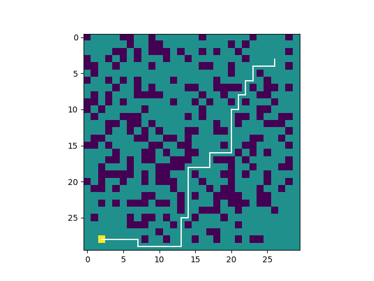
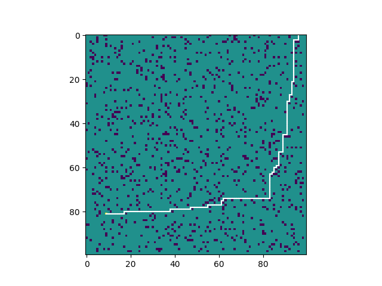
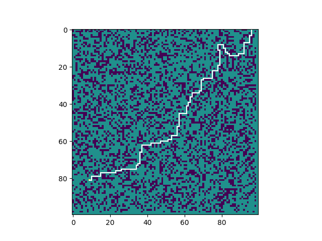

# grid_space_simulator

## Description
A motion planning tool in 2D grid space.

## Usage of simulator
Change the following parameters in the main function:
rows: number of rows in this grid
columns: number of columns in this grid
goal_row: the row index of destination (0 <= goal_row < rows)
goal_col: the column index of destination (0 <= goal_col < columns)
start_row: the row index of starting point (0 <= start_row < rows)
start_column: the column index of starting point (0 <= start_col < columns)
num_obstacle: number of obstacles
gamma: discount factor
iterations: times of value iteration

Then run the python code. A grid world will be created based on the given parameters (number of rows, columns and obstacles), where the path from the given starting point to the given destination will show up.

### Building of grid world 
The size of the grid world is specified by the number of rows and columns. Then the obstacles are generated randomly, but	there is no obstacle withn a small area around the destination and starting point.

In this grid world, each node in this grid should have a reward (aka a value). The destination point has a great positive reward (e.g. 100), whereas	the obstacles have great negative rewards (e.g. -100). The rewards of all the other nodes are 0.

### Motion Planning Strategy
When planning the optimal path from starting point to destination, one reliable criterion is to maximize the total rewards gained along the path. Since the obstacles will bring about great negative rewards, the planned path should be able to avoid bumping into these obstacles. Meanwhile, the destination point is the only one that will provide a positive rewards, so the planned path should tend to approach this destination as much as possible (and ideally, should be able to arrive at the destination point.)

## Experiments
### Experiment 1
starting point is (3,26)(row = 3, col = 26), destination point is (28,2)
30*30 50 iterations, 300 obstacles,

### Experiment 2
starting point is (0,96), destination point is (81,9)
100*100 100 iterations, 1000 obstacles

### Experiment 3
starting point is (0,96), destination point is (81,9)
100*100 150 iterations, 4000 obstacles

Note1: If there are too many obstacles, it is possible that there doesn't exist any route from starting point to the destination.
Note2: If the program hasn't gone through enough iterations, it may not be able to compute the best route.

The number of iterations depends on the size of grid, the position of destination as well as the location of obstacles.
